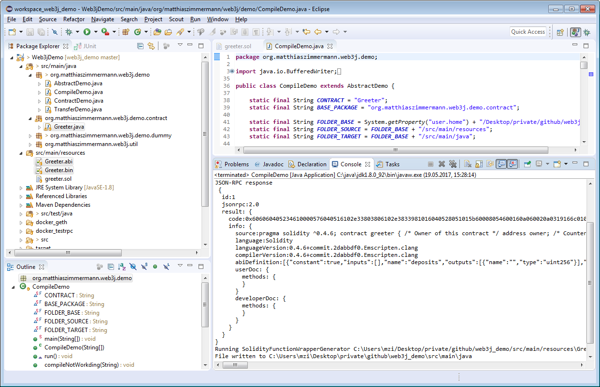

# Ethereum Apps and Java

This repository contains a very simple setup to start developing [Ethereum](https://ethereum.org/) applications with Java. 
For accessing the Ethereum network from Java the [web3j](https://docs.web3j.io/) library is used.  

## Prerequsites

For the demo in this repository the following components are assumed to be correctly installed.

* Java 8
* Maven 3
* Git 1.8
* Docker 1.9

## Building Local Ethereum Clients

This repository provides two alternatives to run a local Ethereum client.

* TestRPC 
* Geth

For both clients a Dockerfile is provided to build corresponding images that can be executed locally and in offline mode.

This is very useful for development and testing of Blockchain applications locally and without any external dependencies like a working Wifi connection.

### TestRPC Client 

The [TestRPC](https://github.com/ethereumjs/testrpc) projects provides the fastest Ethereum client for testing and development of Ethereum applications. 
This makes the TestRPC client ideal for development and automated tests. 

Start with building the TestRPC Docker image from this repository's main directory.

```
~/Web3jDemo
docker build -t ethereum_testrpc docker_testrpc
```

The above command will create a Docker image named ```ethereum_testrpc```.
Expect this process to take a couple of minutes. 

The resulting Docker image can then be used to start a TestRPC client.   

```
~/Web3jDemo
docker run -p 8545:8545 -d ethereum_testrpc
```

The TestRPC container comes with 10 accounts that have an initial balance of 100 Ethers.  
All accounts are unlocked and can be used for Ether transfers.

You can check this from within the running testrpc container.
1. Attach to the docker container
2. Start node
3. Use the web3 JavaScript library to talk to the testrpc client

First, attach to the running testrpc container.

```
~/Web3jDemo
docker exec -it <container-id> bash
```

Inside the docker container cd to the testrpc directory and start node

```
root@<container-id>:/# 
cd /usr/lib/node_modules/ethereumjs-testrpc
node
```

Finally, in the interactive node mode use the web3 library to talk to the testrpc client

```
>
// create web3 object and attach to testrpc
var Web3 = require('web3')
var web3 = new Web3()
web3.setProvider(new Web3.providers.HttpProvider('http://localhost:8545'))
// show coinbase address and its balance in ether
web3.eth.coinbase
web3.fromWei(web3.eth.getBalance(web3.eth.coinbase), "ether")
// show initial testrpc address list and the balance of the second address
web3.eth.accounts
web3.fromWei(web3.eth.getBalance(web3.eth.accounts[1]), "ether")
// transfer 0.5 ethers from the coinbase to the sencond address
web3.eth.sendTransaction({from: web3.eth.coinbase, to:web3.eth.accounts[1], value: web3.toWei(0.5, "ether")})
web3.fromWei(web3.eth.getBalance(web3.eth.accounts[1]), "ether")
```

To exit the interactive node console type twice `<CTRL><C>`. To exit the bash shell in the running docker instance type `exit`.

**IMPORTANT**: There are a number of cases where the behavior of TestRPC differs from Geth, the official Ethereum client.
It is therefore recommended to develop and test Ethereum application not only with TestRPC but also with Geth or other official implementations of the [Ethereum specification](https://github.com/ethereum/go-ethereum/wiki/Ethereum-Specification). 

### Geth Client

[Geth](https://github.com/ethereum/go-ethereum) is the reference implementation for a full Ethereum node that is implemented in the programming language Go. 
The Docker image provided with this repository patches the original Geth sources to minimize the waiting times for mining new blocks. This is useful to reduce waiting times during the development of Ethereum applications.

Start with building the Geth Docker image from this repository's main directory.

```
~/Web3jDemo
docker build -t ethereum_geth docker_geth
```

The above command will create a Docker image named ```ethereum_geth```.
Expect this process to take a couple of minutes. 

The resulting Docker image can then be used to start a local Geth client.   

```
~/Web3jDemo
docker run -it -p 8545:8545 -d ethereum_geth
```

Using the default parameters provided in the Dockerfile the Geth client starts mining and building a fresh private and local blockchain.
Based on the Dockerfile The Geth client has been set up to contain two initial accounts with the first account being unlocked and ready to send Ethers around as soon as the Geth client has accumulated Ethers from its mining process. 

A running Geth container may also be used to work with Geth JavaScript console.
To open a console in the running Geth container use the following Docker command.

```
~/Web3jDemo
docker exec -it <container-id> bash
```

Once in the console of the Geth container, access the running Geth node using ```/geth attach``` as shown below.

```
root@<container-id>:/# /geth attach
Welcome to the Geth JavaScript console!

instance: Geth/v1.5.9-stable-a07539fb/linux/go1.7.5
coinbase: 0x1002d4b236bf23eef87ff3d0b3beae7931753f79
at block: 2521 (Fri, 03 Mar 2017 15:51:07 UTC)
 datadir: /root/.ethereum
 modules: admin:1.0 debug:1.0 eth:1.0 miner:1.0 net:1.0 personal:1.0 rpc:1.0 txpool:1.0 web3:1.0

> eth.getBalance(eth.coinbase)
1.3259508e+22
> exit
root@<container-id>:/# exit
exit
```

## Build the web3j Demo

After cloning this repository build the command line tool using Maven.

```
mvn clean package
```

The result of the Maven build is an executable JAR file.

## Run the web3j Demo
 
Use the following command to run the web3j Hello World.

```
java -jar target/Web3jDemo-1.0-SNAPSHOT.jar
```

The above command runs class ```HelloWorld``` with default parameters (Port=8545 and IP=localhost). 
Connecting to the Geth container the expected output of the command looks like this.

```
Connected to EthereumJS TestRPC/v3.0.5/ethereum-js

Account (to address) 0x6c4adeb473cde981b08825d7edc0f88d356d8b32
Balance before Tx: 100

Transfer 0.123 Ether to account
Nonce for sending address (coinbase): 0
Tx hash: 0x406013305c7b2defa1ae02eae3e47e5748644af1518ef3d6337580989398ad4a
Tx cost: 21000 Gas (0.00042 Ether)

Balance after Tx: 100.123
```

In case you work with Windows expect the Docker container to use a virtual host under a separate IP address and not to run on ```localhost```. 
The command  ```docker-machine ls``` lists the running virtual boxes and their associated IP addresses. 
Running the demo application with a custom ip and a custom port then looks like the following command.

```
java -jar target/Web3jDemo-1.0-SNAPSHOT.jar <docker-ip> <custom-port>
```
  
# Run the Contract Demo in the Eclipse IDE

The repository includes class ```ContractDemo``` to demonstrate the full life cycle of an Ethereum smart contract in a Java project. 

To open this repository in Eclipse open the Eclipse IDE with a new/empty workspace and import the project as existing Maven project.

## Create the Contract Wrapper Class

When changing the greeter smart contract (file ```src/main/resources/greeter.sol```) it will be necessary to re-generate the Java contract wrapper class ```Greeter```. This can be done by running ```CompileDemo``` as shown in the screenshot below.

In the first step ```CompileDemo``` reads in ```greeter.sol``` and compiles it into byte code (file ```greeter.bin```) and contract API (file ```greeter.bin```). In the second step, the web3j wrapper generator is used to create the output (file ```Greeter.java```).



**IMPORTANT**: To compile Solidity code, ```CompileDemo``` relies on a running Ethereum client with an installed Solidity compiler. You may use either of the provided Docker images for this. The IP of the docker image can either be specified as the 1st command line parameter to ```CompileDemo``` or specified in ```Web3jConstants.CLIENT_IP```.

## Rund the Contract Demo


**IMPORTANT**: ```ContractDemo``` relies on a running Ethereum client. You may use either of the provided Docker images for this. The IP of the docker image can either be specified as the 1st command line parameter to ```ContractDemo``` or specified in ```Web3jConstants.CLIENT_IP```.
